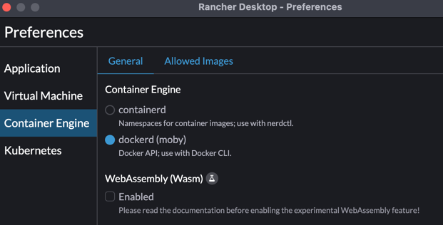
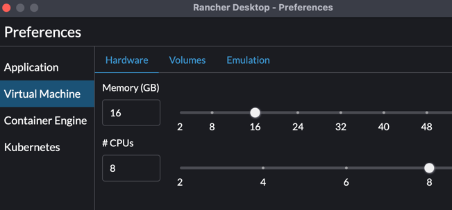
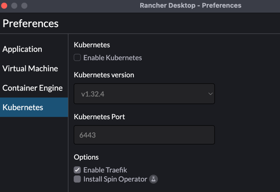

# IBM watsonx Orchestrate ADK Windows Installation Guide

## Introduction

The IBM watsonx Orchestrate Agent Development Kit (ADK) is a set of tools designed to make it easy to build and deploy agents using IBM watsonx Orchestrate.

This guide provides step-by-step instructions for installing the ADK on Windows using Windows Subsystem for Linux (WSL).

## Prerequisites

Before starting the installation, ensure you have:

- **Windows 10 version 2004 or higher** (Build 19041 or higher) or **Windows 11**
- **Administrator access** to your Windows machine
- **Internet connection** for downloading components
- **IBM Cloud account** with access to watsonx.ai services

## Installation Steps

### Step 1: Install Windows Subsystem for Linux (WSL)

1. **Open PowerShell as Administrator:**
   - Press `Windows + X` and select "Windows PowerShell (Admin)" or "Terminal (Admin)"

2. **Install WSL:**
   ```powershell
   wsl --install
   ```

3. **Restart your computer** when prompted

4. **Set up Ubuntu:**
   - After restart, Ubuntu will automatically start
   - Create a username and password when prompted
   - Follow Microsoft's [best practices](https://learn.microsoft.com/en-us/windows/wsl/setup/environment#set-up-your-linux-username-and-password) for setup

**Note:** If Ubuntu doesn't appear after restart, run `wsl --install` again in PowerShell as Administrator.

### Step 2: Install Python

1. **Open Ubuntu terminal** (from Start Menu or by typing `ubuntu` in Windows search)

2. **Update package list:**
   ```bash
   sudo apt update
   ```

3. **Install Python 3.12:**
   ```bash
   sudo apt install python3.12 python3.12-venv python3-pip
   ```

4. **Verify installation:**
   ```bash
   python3.12 --version
   pip --version
   ```

### Step 3: Set up watsonx.ai and Watson Machine Learning

1. **Create IBM Cloud Account:**
   - Sign up at [watsonx AI](https://eu-de.dataplatform.cloud.ibm.com/registration/stepone)

2. **Create a watsonx.ai Project:**
   - Go to [Projects](https://dataplatform.cloud.ibm.com/projects/?context=wx)
   - Click "New Project" and follow the setup wizard

3. **Create a Deployment Space:**
   - Navigate to [Deployment Spaces](https://dataplatform.cloud.ibm.com/ml-runtime/spaces?context=wx)
   - Click "New Space" and associate it with your project
   - Note: You may be able to associate an existing watsonx.ai Runtime Service during creation

4. **Configure Runtime Service:**
   - Open your deployment space
   - Go to the "Manage" tab
   - Associate your watsonx.ai Runtime Service or create a new one

5. **Get Your Space ID:**
   - Go to [Developer Access](https://dataplatform.cloud.ibm.com/developer-access?context=wx)
   - Under "Project or space ID", select "Space" from the Location dropdown
   - Your Space ID will auto-populate - copy this value

6. **Create API Key:**
   - Navigate to [watsonx Home Page](https://dataplatform.cloud.ibm.com/wx/home?context=wx)
   - Under "Developer access", select your deployment space
   - Click "Create API key"
   - Give your key a name and copy/download the key value

### Step 4: Install Docker Engine

The watsonx Orchestrate team recommends [Rancher Desktop](https://rancherdesktop.io/):

1. **Download and install Rancher Desktop** from the official website

2. **Configure Rancher settings:**
   - Open Rancher Desktop
   - Go to Settings
   - Ensure Docker is selected as the container engine
   

   

   - Configure memory and CPU for the virtual machine

   

   - Disable Kubernetes

   

   - Configure according to [recommended settings](https://github.ibm.com/WatsonOrchestrate/wxo-clients/blob/main/_docs/recommended-docker-settings/rancher-settings.md)

3. **Verify Docker installation:**
   ```bash
   docker --version
   docker ps
   ```

### Step 5: Get Entitlement Key

1. **Follow the official guide** to obtain your watsonx Orchestrate entitlement key:
   - Visit [Getting the Entitlement Key](https://developer.watson-orchestrate.ibm.com/getting_started/wxOde_setup#getting-the-entitlement-key)
   - Complete the required steps to generate your key

### Step 6: Create Environment Configuration

1. **Create a .env file** in your home directory:
   ```bash
   cd ~
   nano .env
   ```

2. **Add the following content** (replace with your actual values):
   ```bash
   WO_DEVELOPER_EDITION_SOURCE=myibm
   WATSONX_APIKEY=<your_ibm_cloud_api_key>
   WATSONX_SPACE_ID=<your_watsonx_ai_space_id>
   WO_ENTITLEMENT_KEY=<your_entitlement_key>
   ```

3. **Save the file** (Ctrl+X, then Y, then Enter in nano)

### Step 7: Install the ADK

1. **Install the watsonx Orchestrate package:**
   ```bash
   pip install ibm-watsonx-orchestrate
   ```

2. **Verify installation:**
   ```bash
   orchestrate --version
   ```

### Step 8: Start Local Server and Create Your First Agent

1. **Start the local server:**
   ```bash
   orchestrate server start --env-file=.env
   ```

2. **Set your environment:**
   ```bash
   orchestrate env activate local
   ```
   and check it is active
   ```bash
   orchestrate env list
   ```

3. **Create your first agent:**
   - Follow the [Hello World Tutorial](https://developer.watson-orchestrate.ibm.com/tutorials/tutorial_1_hello_world)

## CLI Reference

After installation, you have access to the WXO CLI tool using the `orchestrate` command:

```bash
orchestrate --help
```

### Available Commands:
- `orchestrate tools` - Manage development tools
- `orchestrate agents` - Manage agents
- `orchestrate server` - Control the local server
- `orchestrate chat` - Chat with agents
- `orchestrate connections` - Manage connections
- `orchestrate models` - Manage models
- `orchestrate env` - Environment management

## Verification

To verify your installation is working correctly:

1. **Check all components:**
   ```bash
   python3.12 --version
   docker --version
   orchestrate --version
   ```

2. **Check your environment is active:**
   ```bash
   orchestrate env list
   ```

3. **Test agent creation:**
   ```bash
   orchestrate agents list
   ```

## Troubleshooting

### Common Issues:

1. **WSL not starting:**
   - Ensure virtualization is enabled in BIOS
   - Run `wsl --update` in PowerShell as Administrator

2. **Docker not accessible from WSL:**
   - Ensure Rancher Desktop is running
   - Check that Docker is selected as the container engine

3. **Permission errors:**
   - Ensure you're using the correct user permissions
   - Try running commands with `sudo` if needed

4. **Environment variables not found:**
   - Verify your `.env` file is in the correct location (`~/.env`)
   - Check that the file has the correct format

### Getting Help:

- **Official Troubleshooting Guide:** [Troubleshooting](https://developer.watson-orchestrate.ibm.com/release/troubleshooting)
- **IBM watsonx Orchestrate Documentation:** [Documentation](https://developer.watson-orchestrate.ibm.com/)
- **WSL Documentation:** [Microsoft WSL Guide](https://learn.microsoft.com/en-us/windows/wsl/)

## Next Steps

After successful installation:

1. **Complete the Hello World Tutorial** to create your first agent
2. **Explore the CLI commands** to understand available functionality
3. **Read the official documentation** for advanced features
4. **Join the community** for support and updates

---

**Note:** This guide is designed for the latest version of the IBM watsonx Orchestrate Agent Development Kit. Always refer to the [official documentation](https://developer.watson-orchestrate.ibm.com/) for the most up-to-date information.